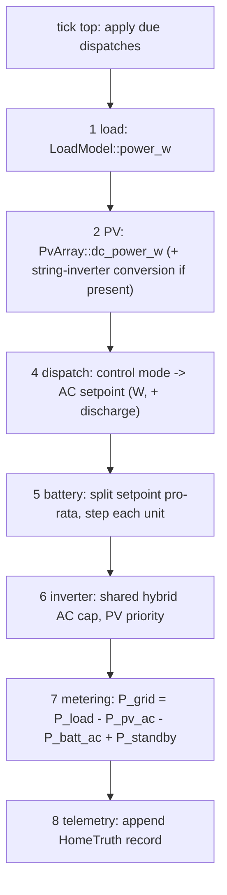

# Architecture

batsim is a deterministic simulator for residential battery fleets in the
ERCOT (Texas) market. It is a Cargo workspace of two library crates and
nothing else: no daemon, no async runtime, no network. This guide covers
how the pieces fit together. For the device catalog schema see
[device-registry.md](device-registry.md); for the physics behind the
battery, inverter, load, and PV models see
[physics-models.md](physics-models.md); for how the determinism and
accuracy claims are enforced see [testing.md](testing.md).

## 1. Workspace layout

The workspace root `Cargo.toml` declares two members:

- `crates/batsim-registry` - the OEM hardware catalog. Device models
  (batteries, inverters, controllers, PV presets) are declarative JSON
  files under `registry/` at the workspace root, embedded into the binary
  at build time via `include_dir`. The shipped catalog holds 21 entries:
  11 batteries, 5 inverters, 4 controllers, 1 PV preset. Every catalog
  number carries a `Provenance` marker with exactly two variants, `Spec`
  (manufacturer datasheet, warranty, or install manual) and `Estimated`
  (inferred, rounded, or secondary source), serialized as snake_case
  `"spec"` / `"estimated"` in JSON.
- `crates/batsim-core` - the simulation engine: tick loop, physics
  models, dispatch, topology routing, telemetry. It depends on
  batsim-registry; batsim-registry depends on nothing in the workspace.

The registry is deliberately data-only. Its types in
`crates/batsim-registry/src/types.rs` exist as serde deserialization
targets that mirror the catalog JSON field-for-field
(`deny_unknown_fields`), plus pure evaluation helpers the engine calls
(e.g. `EfficiencyCurve::eval`). All behavior - stepping, integration,
state machines - lives in batsim-core. The split of responsibilities is
stated at the top of `crates/batsim-registry/src/system.rs`: the registry
validates and computes composition facts; it never constructs engine
types. This keeps the catalog auditable as data and lets a catalog change
be reviewed without reading simulation code.

Registry loading (`crates/batsim-registry/src/load.rs`) happens once at
startup and the result is immutable. Three entry points:

- `Registry::embedded()` loads the catalog compiled into the binary.
- `Registry::from_dir(path)` loads a catalog tree from disk instead.
- `Registry::load(shadow_dir)` layers an optional external directory over
  the embedded catalog (CLI `--registry-dir` / env `SIM_REGISTRY_DIR`,
  legacy `BATSIM_REGISTRY_DIR`); shadowing is entry-by-entry on
  `(kind, model_id)` and every shadow is logged via `tracing`.

Loading runs four phases: per-file SHA-256 verification against
`catalog.json`, JSON parse into the typed targets, semantic validation
(bounds, monotonic efficiency curves, cross-references - every violation
enumerated, never fail-fast), and a whole-catalog `catalog_sha256`
integrity hash over the per-file digests in lexicographic path order.
Lookup maps are `BTreeMap`s keyed by `model_id`, so iteration
(`Registry::batteries()`, `inverters()`, `controllers()`, `pv_presets()`)
is in sorted order.

Both crates build under a pinned toolchain (Rust 1.83.0) with
`missing_docs = "deny"`, `unsafe_code = "forbid"`, and clippy pedantic at
deny with a small set of curated allows in the root `Cargo.toml`.

## 2. The simulation world

`SimWorld` (`crates/batsim-core/src/engine.rs`) owns four things:

```rust
pub struct SimWorld {
    homes: Vec<Home>,
    clock: SimClock,
    master_seed: u64,
    ambient: AmbientFeed,
}
```

- **Home arena** - a plain insertion-ordered `Vec<Home>`. Never a
  `HashMap`: iteration order is exactly insertion order, so traversal is
  deterministic. `SimWorld::add_home` returns the home's stable arena
  index, which doubles as the base of that home's RNG entity key (section 4).
- **`SimClock`** (`crates/batsim-core/src/time.rs`) - the virtual clock:
  `(epoch_s, tick, dt_s)`. `t_sim() = tick * dt_s`,
  `unix_time() = epoch_s + t_sim()`. Construction invariants:
  `1 <= dt_s <= 60` and the epoch is 5-minute aligned so ERCOT settlement
  boundaries fall on `t_sim % 300 == 0`. `SimClock::from_rfc3339` parses
  an ISO-8601 epoch string once at the config boundary.
- **Master seed** - one `u64` that keys every RNG substream in the run.
- **`AmbientFeed`** - the exogenous temperature input. Two deterministic
  variants today: `Constant(degC)` and `DiurnalSine { mean_c,
  amplitude_c }`, the latter a sinusoid peaking at 15:00 local (fixed
  UTC-6). `AmbientFeed::at(unix_time_s)` is a pure function; a
  TMY/NSRDB-driven feed is planned future work.

### Execution modes

All modes run identical per-tick code:

| Method | Behavior |
|---|---|
| `step()` | Advance one tick, stepping every home in arena order. Single-threaded reference implementation. |
| `step_parallel()` | Same tick via rayon; bit-identical state to `step()` (section 4). |
| `step_n(n)` / `step_n_parallel(n)` | Advance `n` ticks. |
| `run_until(t_target_s)` | Advance while `t_sim() < t_target_s`; the primary scenario-replay mode. |
| `run_paced(ticks, speed)` | Advance `ticks` ticks at a `Speed`, sleeping between ticks. Returns the number of pacing overruns. |

`Speed` has three variants: `Realtime` (one tick per `dt_s` of wall
time), `FastForward(n)` (up to `n`x realtime; `n` must be finite and
positive or `run_paced` returns `CoreError::InvalidConfig`), and
`Unbounded` (no pacing code at all; the batch default).

**Pacing never touches numerics.** `run_paced` reads
`std::time::Instant` only to compute how long to `thread::sleep` between
ticks. Wall time never enters simulation state, so a paced run is
bit-identical to `step_n`. When compute overruns the per-tick budget the
engine counts the overrun and moves on - it does not "catch up" by
dropping or batching ticks, so pacing skew is recorded, never silently
absorbed.

## 3. The per-tick home pipeline

`Home::step` (`crates/batsim-core/src/home.rs`) executes a fixed stage
pipeline each tick. The order is mandatory; each stage consumes only what
earlier stages of the same tick produced.



Stage 3 (a price-signal input) is planned future work and does not exist
in the code yet; the dispatch stage reads stages 1-2 of the same tick.

- **Tick top** - `apply_due_dispatches` drains every `ScheduledDispatch`
  with `execute_at_tick <= tick` from the queue (kept sorted by
  `execute_at_tick`, submission order preserved for equal ticks) and
  applies the action: `SetMode`, `SetManualSetpoint`, or `SetReserve`.
- **Stage 1, load** - `LoadModel::power_w(unix_time_s, tick, dt_s,
  t_amb_c)` returns the whole-home load in watts, plus the critical-loads
  share. Stochastic layers draw from the home's load RNG substreams.
- **Stage 2, PV** - `PvArray::dc_power_w` returns array DC output. If the
  system has a dedicated PV string inverter (`HomeDevices::pv_inverter`),
  the array converts here via `dc_to_ac_capped` and never touches the
  battery path. With a hybrid inverter, PV DC lands on the shared bus and
  converts in stage 6 instead.
- **Stage 4, dispatch** - `stage_dispatch` maps the active `ControlMode`
  to a battery-system AC-boundary setpoint in watts (+ discharge):
  `Idle` is 0; `Manual` passes the manual setpoint through;
  `SelfConsumption` computes `load - pv_ac_estimate` (net-zero grid
  exchange); `BackupReserveHold` charges at 25% of aggregate max charge
  power when any unit sits below its reserve floor, else 0.
- **Stage 5, battery** - `stage_battery` splits the AC-boundary setpoint
  across all units pro-rata by dynamic headroom (`max_discharge_w` /
  `max_charge_w`), so mixed-coupling fleets never realize more than the
  setpoint. AC-terminal units take their shares directly. DC-terminal
  (hybrid) units have their combined share translated through
  `hybrid_dc_setpoint`: PV-surplus charging routes DC->DC (single
  inversion), grid charging goes AC -> hybrid -> DC (double conversion),
  and discharge targets are curtailed here - before the pack integrates
  them - by the AC headroom PV already occupies at the shared inverter
  (section 5). Each unit is then stepped via `BatteryUnit::step`.
- **Stage 6, inverter** - `stage_inverter` resolves the shared hybrid
  inverter's AC cap between PV and battery discharge and returns
  `(p_pv_ac, p_batt_ac)` at the panel. Details in section 5.
- **Stage 7, metering** - `stage_metering` closes the balance:
  `P_grid = P_load - P_pv_ac - P_batt_ac + P_standby`, and integrates the
  tick into the `HomeMeters` counters: `main` (bidirectional service
  entrance), `pv_ac`, `batt_ac` (bidirectional), `standby_loss`,
  `pv_clipped`, `batt_clipped`.
- **Stage 8, telemetry** - `stage_telemetry` appends one lossless
  `HomeTruth` record (per-tick power at every boundary plus per-unit
  `UnitTruth`: SOC, terminal power, terminal voltage, conversion heat)
  when `record_truth` is on. Today this is the only telemetry stream;
  vendor noise classes and quantization are planned future work.

**Sign conventions** (module docs of `home.rs`, enforced by the metering
formula):

- Battery power: positive = discharging.
- Grid power: positive = importing.
- `Meter::accumulate` integrates signed power with + = import, - =
  export; the battery meter accumulates `-p_batt_ac` so import = charged,
  export = discharged.

Grid is always present today; outage simulation is planned future work.

## 4. Determinism design

The engine's contract: per-tick work is a pure function of
`(state, tick)`. Five mechanisms make that hold end to end.

**Virtual clock.** Wall time is never read in engine code - no
`SystemTime`/`Instant` in simulation paths (the only exception is
`run_paced`'s inter-tick sleep, section 2). Every timestamp derives from
`t_sim`. Civil time is computed by pure integer math: `civil_local` in
`crates/batsim-core/src/pv.rs` converts unix seconds to a broken-down
local date at a fixed UTC-6 offset (`CST_OFFSET_S = 6 * 3600`, no DST, a
documented Texas simplification) using Howard Hinnant's
`civil_from_days`/`days_from_civil` algorithms - no chrono, no timezone
database, identical results on any host.

**ChaCha stream splitting.** All randomness flows through
`crates/batsim-core/src/rng.rs`:

```text
stream_key(entity, purpose, tick) =
    ChaCha8Rng::seed_from_u64(xxh3_64(master_seed ‖ entity ‖ purpose ‖ tick))
```

`hash64` is `xxh3_64` over the concatenated little-endian fields - one
fixed mixing function, normative. Substreams are stateless functions of
`(seed, entity, purpose, tick)`, constructed per tick on the stack
(`rng::substream`); **no RNG state is ever serialized**, so
snapshot/resume, replay, and parallel scheduling cannot perturb results.
Entity ids are composed by `entity_home(home_idx) = home_idx << 12` and
`entity_device(home_idx, slot)`; slot assignments are fixed constants in
`topology.rs` (batteries `1..=64`, `SLOT_PV = 0x100`, `SLOT_LOAD =
0x101`). Purpose tags (`RngPurpose`) are append-only and never reordered:
`LoadNoise`, `PvCloud`, `TelemetryNoise` (reserved), `DispatchJitter`,
`OutageTrigger` (reserved), `LoadPhase`, `PvPhase`.

**Fixed rayon chunking.** `step_parallel` partitions the arena with a
chunk size computed once as `max(homes / (4 * n_threads), 1)` and uses
`par_chunks_mut`, so the partition is deterministic regardless of thread
scheduling. Homes are independent within a tick and each home's RNG
streams are keyed by `(seed, entity, tick)`, so no cross-home interaction
can leak through scheduling.

**Index-ordered aggregation.** Fleet aggregates are combined in arena
index order, never `par_iter().sum()`: `f64` addition is not associative,
so reduction order must be fixed to keep results bit-identical.

**Exact integer time.** `t_sim`, `unix_time`, tick counters, and civil
dates are all `u64`/`u32` integer math; floating point enters only at
physics quantities, never at time.

The enforcement machinery - the SHA-256 state gate over 10 mixed-model
homes at 1 s ticks, serial vs parallel - lives in
`crates/batsim-core/tests/determinism.rs` and is described in
[testing.md](testing.md), along with the `determinism_demo` example.

## 5. Topology routing

`crates/batsim-core/src/topology.rs` classifies every battery by its
registry `Coupling` and routes energy along explicit loss points. The
predicate `is_ac_terminal` decides which stage owns a unit's conversion:
`ACCoupled` and `MicroinverterBased` are AC-terminal (their conversion
happens at the unit, in stage 5); `DCCoupledHybrid` units terminate on
the shared DC bus (conversion happens at the hybrid inverter, in stage
6).

**AC-coupled.** PV DC -> PV string inverter (loss point) -> AC panel;
battery charge AC -> integrated battery inverter (loss point) -> pack;
discharge pack -> battery inverter (loss point) -> AC. PV and battery
reach the panel over parallel paths; there is no shared-inverter
bottleneck. Microinverter-based batteries (e.g. Enphase IQ Battery) are
AC-terminal the same way, with conversion distributed across per-module
microinverters; `pv_inverter_unit_count` similarly scales per-module PV
inverters to the array's DC nameplate instead of capping it at one box.

**DC-coupled hybrid.** PV DC -> MPPT -> hybrid DC bus; PV -> battery
moves over the battery's DC-DC curve (single inversion); one DC -> AC
inversion at the shared hybrid inverter serves PV and battery discharge
combined, and its AC rating caps the sum. Grid charging remains a double
conversion: AC -> hybrid inverter -> DC-DC -> pack.

**Explicit loss points.** Every conversion goes through an
`EfficiencyCurve` evaluation (`InverterUnit::eta_at_w`, `dc_to_ac_capped`,
`dc_required_for_ac`, `ac_required_for_dc`), and every curtailed watt is
metered: `pv_clipped` for PV energy that could not pass an inverter,
`batt_clipped` for battery discharge that could not pass the shared
inverter. Nothing is silently dropped.

**PV priority at a shared inverter** is enforced in two places, split by
cause:

1. **Command curtailment (stage 5).** `hybrid_dc_setpoint` reduces the
   battery's discharge target before the pack integrates it, by the AC
   headroom PV already occupies (`hybrid_batt_ac_headroom_w` =
   `rated_ac_w - pv_ac` when `pv_priority` is on). A pack may never
   discharge energy the shared inverter cannot pass, so the curtailment
   is a command reduction, not a downstream clip.
2. **PV curtailment (stage 6).** The battery's realized DC is then
   non-negotiable - its energy has left the cells - so stage 6 calls
   `resolve_shared_ac_cap(rated, pv_candidate, batt_candidate, false)`
   (battery admitted first) and any residual overflow curtails PV, which
   is losslessly curtailable at the MPPT. The overflow lands in
   `pv_clipped`.

`pv_priority` comes from `HomeBuildConfig` and matches hybrid firmware
defaults; with it off the battery owns the whole shared rating.

## 6. Composition flow

Building a simulated home is a four-step pipeline:


1. **Document.** A `HomeSystem` JSON document declares line items:
   `batteries[]`, `inverters[]`, `controllers[]` (each a `model_id` +
   `quantity` plus per-battery SOC/reserve settings), optional `pv`,
   `main_panel`, `backup_panel`, `generator`, `ev_charger`, `grid_meter`.
   `HomeSystem::from_json` parses it (`RegistryError::Parse` on malformed
   input).
2. **Validate.** `HomeSystem::validate(&registry)` resolves every
   `model_id` against the catalog and enforces the composition rules -
   schema version, quantity and SOC-window bounds, exactly one
   grid-forming controller when backup-capable, hybrid battery/inverter
   compatibility and per-inverter unit ceilings, expansion-pack rules,
   microinverter power ceilings, generator and PV landing-pad rules - and
   returns a `SystemSpec`. All violations are enumerated in one
   `RegistryError::Validation`, never fail-fast. `SystemSpec` carries the
   source document plus resolved facts the engine would otherwise
   re-derive: `total_usable_energy_kwh`, `total_discharge_power_kw`,
   `total_charge_power_kw`, `backup_path_power_kw`,
   `resolved_controller_model_id`, and `has_dc_coupled_storage`.
3. **Build.** `build_devices(&spec, &registry, &HomeBuildConfig,
   master_seed, home_idx)` in `topology.rs` constructs the live
   `HomeDevices`: one `BatteryUnit` per physical unit in declaration
   order, the shared hybrid inverter and/or dedicated PV string inverter
   (an integrated hybrid is synthesized for DC-coupled batteries like the
   Powerwall 3 whose document names no inverter), the `PvArray`, and the
   `LoadModel`. `HomeBuildConfig` supplies the scenario-side inputs that
   are not in the catalog document: `LoadConfig`, optional `PvSiteConfig`
   (latitude, longitude, shading, cloud noise), `BatteryConfig`, and
   `pv_priority`. Unknown models surface as `CoreError::InvalidSystem`.
4. **Inhabit.** `Home::new(devices, record_truth)` starts in
   `ControlMode::SelfConsumption` with empty meters;
   `SimWorld::add_home` assigns the arena index that keys the home's RNG
   substreams.

The canonical walkthrough is `crates/batsim-core/examples/support/mod.rs`:
`load_config()` (reference 2400 sqft Austin home), `pv_site()` (Austin
coordinates, clear-sky feed), `build_config(with_pv)`, and
`one_battery_system(registry, model_id, with_pv)`, which composes a valid
one-battery HomeSystem for any catalog model - adding the vendor-required
hybrid inverter and controller automatically - and validates it. Four
runnable examples build on it:

```bash
cargo run -p batsim-core --example single_home_trace
cargo run -p batsim-core --example fleet_energy
cargo run -p batsim-core --example catalog_browser
cargo run -p batsim-core --example determinism_demo
```

## 7. Error handling

Both crates use `thiserror` enums; there are no panics on the user-input
path.

`CoreError` (`crates/batsim-core/src/error.rs`) covers engine
construction, composition, and stepping:

| Variant | Raised when |
|---|---|
| `InvalidConfig(String)` | Bad static configuration: `dt_s` outside `1..=60`, unaligned epoch, non-positive `FastForward` multiplier. |
| `Registry(RegistryError)` | The registry could not provide a required entry (`#[from]` conversion). |
| `InvalidSystem(String)` | A HomeSystem composition fails validation at build time (re-checked in `build_devices`). |
| `Dispatch(String)` | A dispatch command cannot be applied, e.g. `SimWorld::dispatch` to a nonexistent home index. |
| `Serialization(String)` | Engine state serialization failed. |

`RegistryError` (`crates/batsim-registry/src/error.rs`) covers catalog
loading and validation: `Io` (unreadable file), `Parse` (invalid JSON or
schema-shape mismatch), `Validation { violations }` (semantic failures -
a `Vec<Violation>` where each `Violation` names the registry-relative
`path`, the JSON `field`, and a `message`, with every violation across
all entries enumerated in one error), `Integrity` (`catalog.json` hashes
do not match entry files - tamper detection), `Duplicate` (two entries
sharing a `(kind, model_id)` key), and `UnknownModel` (a queried
`model_id` does not exist).

## 8. Planned future work

The engine is a library today; there is no server. Planned additions,
deliberately absent from the current code:

- **HTTP API** - a service layer exposing the fleet: the dispatch layer
  (`DispatchAction` is documented as the subset of the planned
  `/v1/dispatch` actions), HTTP-layer latency modeling, and market
  dispatch. The `DispatchJitter` RNG purpose tag is already reserved for
  execution jitter.
- **Outages and backup-panel physics** - the grid is always present
  today; `OutageTrigger` is reserved in the RNG purpose enum and the
  `BACKUP_PANEL` meter point is not yet wired.
- **Vendor telemetry noise** - quantization, rate decimation, and
  measurement noise classes over the lossless truth stream
  (`TelemetryNoise` is reserved).
- **TMY/NSRDB ambient feed** - hourly Texas weather with Catmull-Rom
  interpolation behind the existing `AmbientFeed` pure-function contract.
- **Thermal and degradation models** - lumped cell thermal dynamics and
  degradation tracking; the ambient feed currently stands in for cell
  temperature.
