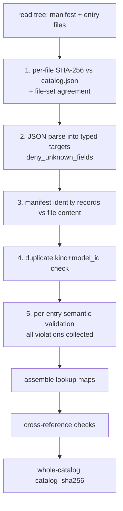

# Device Registry

The device registry (`batsim-registry`) is the catalog of OEM hardware the
simulator can model. Devices are data, not code: every battery, inverter,
controller, and PV preset is a declarative JSON document, and the Rust types
exist only as serde deserialization targets plus a few evaluation helpers
(`crates/batsim-registry/src/lib.rs`). This guide covers the catalog format,
the loading pipeline, the type system, system composition, and how to add a
device. For how the engine consumes these models, see
[architecture.md](architecture.md) and [physics-models.md](physics-models.md).

## What the registry is

The catalog lives under `registry/` at the workspace root and holds 21
entries: 11 batteries, 5 inverters, 4 controllers, 1 PV preset. It is
embedded into the binary at build time via `include_dir!`
(`static EMBEDDED` in `crates/batsim-registry/src/load.rs`), so a release
binary is self-contained.

Three design rules, from `lib.rs`:

- The catalog is immutable after load; loading happens once at startup.
- Validation errors enumerate every broken entry, not just the first.
- Unknown catalog values are omitted (`Option::None`), never invented.

`Registry` exposes three constructors:

- `Registry::embedded()` - the build-time catalog.
- `Registry::from_dir(dir)` - a catalog tree on disk, no embedded layer.
  If the directory has no `catalog.json`, a manifest is synthesized from
  on-disk content hashes (`registry_version` becomes `"0.0.0-external"`).
- `Registry::load(shadow_dir)` - the embedded catalog with an external
  directory layered over it. External entries shadow embedded entries
  one-for-one on `(kind, model_id)`; entries with new keys are added.
  Every shadow is logged at `warn` level and every addition at `info`
  level via `tracing`, and the shadowed keys are recorded in
  `RegistrySource::External { dir, shadowed }` (returned by
  `Registry::source()`). Callers resolve the directory from the
  `--registry-dir` CLI flag or the `SIM_REGISTRY_DIR` environment
  variable (legacy name `BATSIM_REGISTRY_DIR`; see the `Registry::load`
  doc comment); the crate itself takes an `Option<&Path>`.

Lookup is by `model_id`: `battery()`, `inverter()`, `controller()`,
`pv_preset()` return `Option<&T>`; `batteries()`, `inverters()`,
`controllers()`, `pv_presets()` iterate in sorted id order.
`Registry::manifest()` returns the loaded `CatalogManifest`.

A quick way to browse the catalog:

```sh
cargo run -p batsim-core --example catalog_browser
```

## Catalog format

### Directory layout

```
registry/
  catalog.json                      # manifest (integrity + index)
  batteries/    *.json              # 11 entries
  inverters/    *.json              # 5 entries
  controllers/  *.json              # 4 entries
  pv_presets/   *.json              # 1 entry
```

The subdirectory determines the entry kind (`EntryKind::dir` /
`EntryKind::from_dir` in `types.rs`). Every entry declares a globally
unique `model_id` (`preset_id` for PV presets) of the form
`vendor.model`, matching `^[a-z0-9_]+\.[a-z0-9_]+$` with the prefix
matching the `vendor` field case-insensitively. The filename is the
`model_id` with the dot replaced by an underscore:
`tesla.powerwall_3` lives at `batteries/tesla_powerwall_3.json`
(the reverse mapping is `entry_path` in `validate.rs`).

The 21 entries:

| Kind | model_id |
|---|---|
| battery | `tesla.powerwall_2`, `tesla.powerwall_3`, `tesla.pw3_expansion_pack`, `enphase.iq_battery_5p`, `enphase.iq_battery_10`, `enphase.iq_battery_10c`, `solaredge.home_battery_400v`, `sonnen.ecolinx`, `sonnen.sonnencore_plus`, `sonnen.sonnenbatterie_10_ac`, `sonnen.sonnenbatterie_10_hybrid` |
| inverter | `tesla.pw3_integrated_hybrid`, `enphase.iq8d_micro`, `solaredge.home_hub_hd_wave`, `sonnen.hybrid_inverter_8kw`, `generic.string_pv_8kw` |
| controller | `tesla.gateway_2`, `enphase.iq_system_controller_2`, `solaredge.backup_interface`, `sonnen.sonnenprotect` |
| pv_preset | `residential.south_8kw` |

### Versioning

Two version fields appear on every entry:

- `schema_version` - must equal the crate constant `SCHEMA_VERSION`,
  currently `"1.0.0"` (`types.rs`). A mismatch is a validation violation.
- `entry_version` - content revision of that entry, a semver triple
  `^\d+\.\d+\.\d+$`. Bump it when you edit the entry's content.

An optional `supersedes` field on batteries names the `model_id` of the
entry this one replaces.

### The manifest (`catalog.json`)

`CatalogManifest` (`types.rs`) carries:

- `registry_version` - one semantic version for the whole registry,
  bumped on any entry add/change/remove.
- `schema_version` - the schema the entries conform to.
- `entries[]` - one `CatalogEntry` record per file: `path` (registry-
  relative), `kind` (`battery` / `inverter` / `controller` /
  `pv_preset`), `model_id`, `entry_version`, and `sha256`, the lowercase
  hex SHA-256 of the entry file's UTF-8 bytes.
- `catalog_sha256` - whole-catalog integrity hash: SHA-256 over the
  concatenation, in lexicographic path order, of each entry file's raw
  32-byte SHA-256 digest, hex-encoded (`catalog_sha256()` in `load.rs`).

The manifest's identity records must also match file contents: after
parsing, the loader compares each record's `kind`, `model_id`, and
`entry_version` against what the file actually declares
(`verify_manifest_identity`).

## Loading pipeline

`load_entries()` + `finalize()` in `load.rs` run these phases in order,
for the embedded tree and for any shadow tree alike:



1. **Per-file content-hash verification** (`verify_file_hashes`). Every
   file's SHA-256 must match its manifest record, every manifest record
   must have a file on disk, and every entry file must be declared. All
   mismatches are enumerated in one `RegistryError::Integrity` message.
2. **JSON parse** (`parse_entry`). Bytes are deserialized into the typed
   target for the directory's kind. All types use
   `#[serde(deny_unknown_fields)]`, so a misspelled or obsolete field is
   a `RegistryError::Parse`, not silent data loss.
3. **Manifest identity check** (`verify_manifest_identity`).
4. **Duplicate detection.** Two entries sharing `(kind, model_id)` in one
   tree fail with `RegistryError::Duplicate`.
5. **Per-entry semantic validation** (`validate::check_battery` etc.).
   Cross-field invariants the types cannot express. Every violation is
   collected into `Vec<Violation>` (`{path, field, message}`), never
   fail-fast; any violation fails the load with
   `RegistryError::Validation` listing all of them. Checks include
   (`crates/batsim-registry/src/validate.rs`):
   - `schema_version` / `entry_version` / `model_id` formats and the
     vendor-prefix match.
   - Efficiency curves: >= 2 points, strictly ascending finite
     non-negative `x_kw`, efficiencies in `[0, 1]`.
   - `usable_energy_kwh <= nameplate_energy_kwh`; power/energy values
     finite and non-negative; peak >= continuous discharge, and peak
     power and `peak_duration_s` declared together.
   - SOC window `0 <= min < max <= 1`, reserve floor inside the window.
   - Microinverter entries: `microinverter_count >= 1`, only on
     `MicroinverterBased` coupling, continuous power <=
     `power_per_microinverter_kw x microinverter_count` (the Enphase
     ceiling rule; enclosure AC limits on the IQ Battery 10/10C
     legitimately sit below it, so equality is not required).
   - Controller curtailment span `0 < start_hz < full_curtail_hz`; PV
     preset tilt in `[0, 90]`, azimuth in `[0, 360)`.
6. **Cross-reference checks** (`check_cross_references`) run on the
   assembled registry: every `requires_controller_id`,
   `compatible_battery_ids` entry, `expansion_pack_model_id`, and PV
   preset `pv_inverter_model_id` must resolve. A DC-coupled hybrid
   battery without an integrated inverter must be claimed by at least one
   hybrid inverter's `compatible_battery_ids`.
7. **Whole-catalog integrity.** The recomputed `catalog_sha256` must
   equal the manifest's. A tampered file or tampered hash fails here or
   in phase 1; both cases are covered by unit tests in `load.rs`
   (`tampered_entry_fails_integrity_and_names_file`,
   `tampered_catalog_hash_fails_integrity`).

When a shadow directory is present, the same pipeline runs on it
standalone first; only then is the union assembled, its manifest rebuilt
(embedded records win unless shadowed), cross-references re-checked on
the union, and `catalog_sha256` recomputed.

## Provenance markers

Every numeric or categorical catalog value carries a `Provenance` marker
(`types.rs`), serialized snake_case in JSON:

- `spec` - appears in a manufacturer datasheet, warranty, or install
  manual.
- `estimated` - inferred, rounded, or from secondary sources.

Two rules govern their use:

- **Estimated values must never be silently promoted to spec.** If a
  figure is derived, it stays `estimated` and the `note` field explains
  the derivation. Example: the PW3's `continuous_charge_power_kw` is
  `estimated` (grid-charge AC-side figure), while its
  `nameplate_energy_kwh` is `spec`.
- **Unknown values are `Option::None`, not invented.** Optional fields
  (`peak_discharge_power_kw`, `rte_ac_coupled`, `mppt_count`,
  `max_batteries`, warranty sub-fields, ...) are simply absent when the
  manufacturer does not publish them.

In practice this means the catalog mixes grades deliberately: all
efficiency curves are `estimated`, while nameplate energy and RTE figures
are mostly `spec`. A unit test in `load.rs`
(`spec_nameplate_values_and_provenance`) pins these expectations per
device.

## Key types

All types are in `crates/batsim-registry/src/types.rs`. Catalog units:
energy kWh, power kW, temperature degC, durations seconds, efficiencies
fractions in `[0, 1]`. Conversion to the engine's SI watts/watt-hours
happens in batsim-core.

### `AnnotatedNumber`

The workhorse scalar: `{ value, provenance, unit?, note? }`. `unit` is a
free label (`"kWh"`, `"kW"`, `"degC"`, `"frac"`, ...); `note` records
assumptions. Constructors `AnnotatedNumber::spec(value, unit)` and
`AnnotatedNumber::estimated(value, unit, note)` build graded values.

### `EfficiencyCurve`

Piecewise-linear conversion efficiency: `points: Vec<EfficiencyPoint>`
(`{ x_kw, efficiency }`, minimum 2, `x_kw` strictly ascending) plus a
curve-level `provenance`.

Semantics of `EfficiencyCurve::eval(x_kw)`:

- The x-axis is kW at the device's terminal boundary - AC-side for
  AC-coupled integrated devices, DC-bus-side for DC-coupled hybrid packs.
- Evaluation uses the magnitude (`x_kw.abs()`), so one curve serves both
  power directions.
- Linear interpolation between sample points; clamped (never
  extrapolated) to the endpoint efficiencies outside the sampled range.

The curves are calibrated, not decorative: see "Round-trip efficiency
calibration" below.

### `BatteryModel`

The largest entry type. Required fields: identity (`schema_version`,
`entry_version`, `model_id`, `vendor`, `display_name`), `chemistry`
(`LFP` / `NMC` / `NCA`; NCA is schema-accepted but unused),
`coupling` (`ACCoupled`, `DCCoupledHybrid`, `MicroinverterBased`),
energy (`nameplate_energy_kwh`, `usable_energy_kwh` - the engine never
operates outside usable), power (`continuous_discharge_power_kw`,
`continuous_charge_power_kw`, optional `peak_discharge_power_kw` +
`peak_duration_s`), `soc_window` (`min_soc_frac`, `max_soc_frac`,
optional `reserve_floor_frac`), `charge_efficiency_curve` and
`discharge_efficiency_curve`, optional `rte_pv_coupled` /
`rte_ac_coupled` round-trip efficiencies, `grid_forming_in_backup`,
optional `requires_controller_id`, `integrated_inverter`, microinverter
fields (`microinverter_count`, `power_per_microinverter_kw` - 0.64 kW
per IQ8D), `expansion` metadata, `warranty` (tracked, never enforced),
`operating_temperature`, `cooling`, `ramp_rate` (estimated everywhere:
full swing in ~1 s), `self_discharge_frac_per_day` (folds in idle draw),
and `vendor_api` mimicry metadata (API family, auth style, endpoint list)
consumed by the planned vendor-API mimicry layer of the HTTP API.

All battery power values are at the device boundary: AC-side for
AC-coupled and microinverter devices, DC-bus-side for DC-coupled hybrids.

### `InverterModel`

`topology` (`HybridDCCoupled`, `StringPVOnly`, `MicroinverterPV`,
`BatteryIntegrated`), `rated_ac_output_kw`, optional
`max_ac_output_kw_backup`, PV input limits (`max_pv_dc_input_kw`,
`mppt_count`, `max_pv_voltage_v`), a DC-to-AC `efficiency_curve`,
`grid_following_on_grid` (default true) / `grid_forming_in_backup`,
`compatible_battery_ids` (non-empty for hybrids), optional
`max_batteries` (SolarEdge Home Hub: 3), and optional `vendor_api`.

### `ControllerModel`

The system controller / gateway / transfer device owns islanding
mechanics: `provides_grid_forming`, `transfer_time_s` (estimated
defaults: Tesla Gateway 0.1 s, IQ System Controller 1.0 s, SolarEdge
0.5 s, sonnenprotect 1.5 s), optional `reconnect_s` (every catalog controller declares an
estimated 300 s),
`supports_generator_input`, optional `frequency_shift_curtailment`
(`CurtailmentCurve { start_hz, full_curtail_hz, provenance }` for
Watt-Hz PV droop while islanded), optional `max_backup_power_kw`,
`pv_blackstart`, and `standby_power_w`.

### `PvPreset`

A pre-canned residential array: `preset_id`, `kw_dc`, `tilt_deg`,
`azimuth_deg` (180 = south), `dc_ac_ratio` (default 1.2), and either a
`pv_inverter_model_id` or null (PV lands on a hybrid inverter's MPPTs),
plus `microinverter_count` when microinverter-based. The one catalog
preset, `residential.south_8kw`, is an 8.0 kW DC south array at 25 deg
tilt behind `generic.string_pv_8kw`.

## HomeSystem composition

`HomeSystem` (`crates/batsim-registry/src/system.rs`) is the declarative
document describing one installed system. Shape:

```json
{
  "schema_version": "1.0.0",
  "system_id": "00000000-0000-0000-0000-00000000000b",
  "batteries":    [{ "model_id": "tesla.powerwall_3", "quantity": 1,
                     "expansion_packs_per_unit": 0,
                     "initial_soc_frac": 0.5, "reserve_frac": 0.2 }],
  "inverters":    [],
  "controllers":  [{ "model_id": "tesla.gateway_2", "quantity": 1 }],
  "pv":           { "kw_dc": 8.0, "orientation": "S", "tilt_deg": 25,
                    "dc_ac_ratio": 1.2, "pv_inverter_model_id": null },
  "main_panel":   { "service_rating_a": 200, "interconnection_limit_kw": null },
  "backup_capable": true,
  "backup_panel": { "critical_loads_peak_kw": 5, "whole_home": false },
  "generator":    null,
  "ev_chargers":  [],
  "grid_meter":   { "esiid": "...", "tdsp": "..." }
}
```

Defaults on a `BatteryRef`: `expansion_packs_per_unit` 0,
`initial_soc_frac` 0.5, `reserve_frac` 0.2. `Orientation` accepts a named
compass point (`"S"`, `"SW"`, `"FLAT"`, ...) or an explicit azimuth in
degrees. `grid_meter.esiid` is the ERCOT ESI ID binding, consumed by the
planned market-dispatch layer.

`HomeSystem::validate(&registry)` checks the composition against the
registry, enumerating all violations, and returns a resolved
`SystemSpec`. Enforced rules:

- Every `model_id` resolves to an entry of the matching kind; quantities
  are >= 1; SOC/reserve fractions lie in `[0, 1]`; each battery's initial
  SOC lies inside its model's SOC window.
- **Required controllers.** `backup_capable` requires exactly one present
  controller with `provides_grid_forming = true`, and every battery's
  `requires_controller_id` (e.g. PW3 requires `tesla.gateway_2`) must be
  present in `controllers[]`.
- **Hybrid pairing.** A DC-coupled hybrid battery without an integrated
  inverter (SolarEdge Home Battery, sonnen Batterie hybrid) must be
  listed in some present hybrid inverter's `compatible_battery_ids`;
  conversely a present hybrid inverter must name at least one system
  battery. Batteries with `integrated_inverter = true` (PW3) are their
  own hybrid inverter and are exempt.
- **Inverter capacity.** Per battery model, unit count <= sum of
  `max_batteries x quantity` over present compatible inverters, when all
  of them declare the limit (SolarEdge: 3 batteries per Home Hub).
- **Enphase microinverter ceiling.** Continuous charge/discharge ratings
  must not exceed `microinverter_count x power_per_microinverter_kw`.
  0.64 kW per IQ8D is a ceiling: exact for the 5P (6 x 0.64 = 3.84 kW),
  loose for the IQ Battery 10/10C whose enclosure AC limits sit below
  12 x 0.64 kW. Peak discharge must be >= continuous.
- **Expansion packs add energy, not power.** Packs are allowed only on
  models declaring `expansion_pack_model_id` (PW3 only);
  `expansion_packs_per_unit` <= `max_units_per_inverter - 1` (PW3: 4 - 1
  = 3); a model declaring `packs_add_power = true` is rejected.
- **Generator interlock.** A generator requires a present controller
  with `supports_generator_input = true` (Tesla Gateway 2 declares
  false).
- **PV landing pad.** A null `pv_inverter_model_id` requires a present
  hybrid: a `HybridDCCoupled` inverter's MPPTs or an integrated-inverter
  DC-coupled battery such as PW3.

The resolved `SystemSpec` is what batsim-core consumes at
simulation-init:

- `total_usable_energy_kwh` - sum over line items of
  `quantity x (head usable + packs-per-unit x pack usable)`.
- `total_discharge_power_kw` / `total_charge_power_kw` - sums of
  continuous ratings; expansion packs contribute zero power.
- `backup_path_power_kw` - the minimum of every series stage of the
  backup path: total battery discharge, the sum of
  `max_ac_output_kw_backup` (else `rated_ac_output_kw`) over present
  explicit inverters, and the sum of `max_backup_power_kw` over
  controllers that declare it. With no explicit inverter and no
  controller cap (integrated-inverter batteries), the battery sum stands
  alone. `None` when not backup-capable.
- `resolved_controller_model_id` - the single grid-forming controller.
- `has_dc_coupled_storage` - selects the single-inversion PV-to-storage
  loss path in the engine (see [physics-models.md](physics-models.md)).

`system.rs` validates and computes only; `batsim_core::topology` turns a
`SystemSpec` into live device state (see
[architecture.md](architecture.md)).

## Adding a device

1. **Write the entry JSON.** Copy an existing entry of the same kind as a
   starting point (e.g. `registry/batteries/tesla_powerwall_3.json` for a
   battery) and edit. Keep every field the type requires - the types use
   `deny_unknown_fields` and required fields have no defaults, so a
   missing or extra key fails the load. Grade every value `spec` or
   `estimated` honestly and put derivations in `note`.
2. **Name the file** after the `model_id` with the dot replaced by an
   underscore: `acme.powercell_1` -> `registry/batteries/acme_powercell_1.json`.
3. **Add the manifest record** in `registry/catalog.json`: `path`,
   `kind`, `model_id`, `entry_version`, and `sha256` of the file bytes:

   ```sh
   shasum -a 256 registry/batteries/acme_powercell_1.json
   ```

4. **Recompute `catalog_sha256`**: concatenate the raw 32-byte SHA-256
   digests (not hex strings) of every entry file in lexicographic path
   order, SHA-256 the result, hex-encode. The exact algorithm is
   `catalog_sha256()` in `crates/batsim-registry/src/load.rs`. Also bump
   `registry_version`, and bump `entry_version` on any entry you touched.
5. **Run the registry tests:**

   ```sh
   cargo test -p batsim-registry
   ```

   This loads the embedded catalog end to end
   (`embedded_catalog_loads_and_counts`), re-runs every semantic and
   cross-reference check, and pins per-device nameplate/provenance
   expectations. Note the embedded catalog is compiled in - a `cargo
   build` (or test) re-embeds it; editing JSON without rebuilding changes
   nothing at runtime.

6. **Check round-trip efficiency calibration.** If you added a battery,
   its charge/discharge curves are checked against its declared RTE. The
   normative calibration (`ac_path_rte_calibration_holds` in `load.rs`)
   requires the AC-path round trip at the 0.5C power point (half the
   usable energy in kW) to land within 0.5 percentage points of the
   declared `rte_ac_coupled`: for AC-coupled entries the product is
   `eta_chg x eta_coul x eta_dis` (coulombic efficiency 0.99 LFP /
   0.98 NMC); DC-coupled hybrids additionally multiply by the claiming
   hybrid inverter's efficiency squared, because grid charge on a hybrid
   is a double conversion. The engine-level conformance suite in
   `crates/batsim-core/tests/rte_conformance.rs` measures the simulated
   AC-path RTE of every standalone catalog battery against the same 0.5
   pp bound, so a curve that does not reproduce the declared figure fails
   CI. To see per-device figures while tuning a curve:

   ```sh
   cargo test -p batsim-core --test rte_conformance rte_report -- --ignored --nocapture
   ```

See [testing.md](testing.md) for the full test-suite layout, including
the golden SOC traces and determinism gate that also load the registry.
