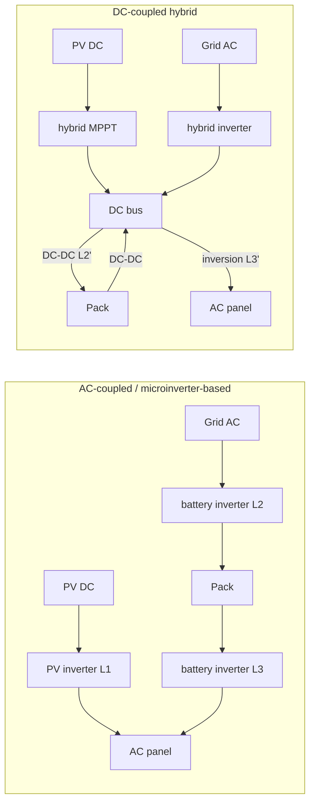

# Physics Models

How batsim computes power and energy, device by device. Sources:

- `crates/batsim-core/src/battery.rs` - battery unit state machine and SOC integrator
- `crates/batsim-core/src/chemistry.rs` - per-chemistry OCV tables, resistance modifiers, cold rules
- `crates/batsim-core/src/inverter.rs` - conversion stages, clipping, standby
- `crates/batsim-core/src/topology.rs` - coupling-aware routing and device construction
- `crates/batsim-core/src/load.rs` - home load synthesis
- `crates/batsim-core/src/pv.rs` - PV array model
- `crates/batsim-core/src/home.rs` - the per-tick pipeline that wires the stages together

For where these modules sit in the engine see [architecture.md](architecture.md); for the
catalog data they consume see [device-registry.md](device-registry.md); for how the gates
around them run see [testing.md](testing.md).

## 1. Battery SOC model

A `BatteryUnit` is one physical battery unit; a home with N units holds N instances.
Terminal power `p_term_w` is positive when discharging out of the device boundary,
negative when charging.

### Energy path

The integrator (`BatteryUnit::integrate_soc`) uses split conversion efficiencies from the
registry curves, evaluated at the current power and cold-derated (see section 2):

- Charge (`p_w < 0`, magnitude `q_w`): stored energy gains
  `q_w * eta_chg(|q_w|) * eta_coul * dt`. The conversion efficiency multiplies.
- Discharge (`p_w > 0`): stored energy drains `p_w * dt / eta_dis(p_w)`. The conversion
  efficiency divides.

`eta_coul` is the coulombic efficiency per chemistry (`chemistry::eta_coul`): LFP 0.99,
NMC/NCA 0.98. It applies on charge only.

### Sub-stepping

`BatteryUnit::step` splits any engine tick longer than 5 s into `ceil(dt/5)` sub-steps
(`MAX_SUB_STEP_S = 5`). Power limits are computed once per tick; the sub-stepped
integration keeps the SOC-window boundary checks exact per sub-step.

### SOC window and reserve floor

The unit integrates `e_stored_wh`, the energy above the SOC-window floor. The window is
`[soc_min, soc_max]` from the registry model, spanning `e_window_wh =
(soc_max - soc_min) * q_avail_wh`. The discharge floor is the user reserve while the grid
is present: `effective_floor = max(soc_min, reserve_frac)`. During an outage with
`release_reserve_in_outage` (default true) the floor drops to the hard `soc_min`.

Each tick the request is clamped to the largest power whose converted energy fits the
remaining headroom (`energy_window_limit`), solved by 60-step bisection
(`WINDOW_BISECT_ITERS`) on the exact per-tick energy expression - the clamp is
energy-exact, never an f64 drift source.

### Other per-tick limits (in `step` order)

1. Ramp slew: the command moves toward the setpoint by at most `ramp_w_per_s * dt`
   (registry ramp rate; a nonpositive declared rate means no slew limit).
2. Min on/off: DC-coupled hybrid units get 60 s / 60 s, AC-terminal units 0 / 0.
   Direction changes and stops are held until the integer tick timers expire.
3. Dynamic limits: thermal derate, chemistry cold rules, Thevenin sag, discharge-cutoff
   temperature (section 2).
4. SOC window clamp (above).
5. Sub-stepped SOC integration.
6. Peak-budget accumulator: throughput above the thermally derated continuous rating
   drains `peak_budget_ws`; at or below it, the budget recovers at
   `0.25 * (peak - continuous)` watts per second up to the cap
   `(peak - continuous) * peak_duration_s`.

### Energy conservation by construction

All electrical conversion loss becomes heat, reported per tick as `heat_w`:

- discharge: `heat = p_w * (1/eta - 1)`
- charge: `heat = q_w * (1 - eta * eta_coul)`

The Thevenin internal resistance `R_int` is used only for power-limit sag and terminal
voltage telemetry; it is never a second energy loss. Self-discharge folds in at
`self_discharge_frac_per_day`, default 0.002 (0.2 %/day, including idle/standby draw)
when the catalog omits the field.

## 2. Chemistry modules (`chemistry.rs`)

### OCV tables

17-point open-circuit-voltage tables at SOC fractions 0.0, 0.0625, ..., 1.0
(`OCV_SOC_POINTS = 17`), scaled to a 400 V nominal pack (`NOMINAL_PACK_V`): cell voltage
times `400 / v_cell_nominal` with 3.2 V (LFP) and 3.6 V (NMC), so chemistry differences
live in the shape only. NCA shares the NMC table.

- `LFP_OCV_V`: 341.00 V at SOC 0, flat mid-range (~2.8 % swing over SOC 15-90 %), knees
  below 10 % and above 95 %, 462.50 V at SOC 1.
- `NMC_OCV_V`: near-linear, ~16.9 % swing across the window, 366.00 V at SOC 0 to
  428.00 V at SOC 1. The NMC floor sits well above the 340 V pack cutoff so the Thevenin
  model does not throttle the last ~10 % of usable energy at 25 degC.

Both tables start slightly above the cutoff voltage because a vendor's usable floor is a
firmware limit, not absolute empty.

Interpolation is Fritsch-Carlson monotone cubic (PCHIP): secant slopes, tangents zeroed
at local extrema and harmonic-mean limited elsewhere, cubic Hermite basis per interval.
Monotone input yields a monotone interpolant, and the zero-tangent rule prevents
overshoot at the LFP knees - linear interpolation there is explicitly not acceptable.

### Internal resistance and Thevenin sag

Base resistance (`base_internal_resistance`): `R_base` dissipates 7.7 % of rated
continuous power as I^2R heat at rated current `I_rated = p_rated_w / 400`, i.e.
`R_base = 0.077 * p_rated_w / I_rated^2`.

Modifiers (`r_int`), multiplicative:

```text
R_int = R_base
    * (1 + 1.5   * max(0, 0.15 - soc) / 0.15)     // low-SOC rise
    * (1 + 0.3   * max(0, soc - 0.95) / 0.05)     // high-SOC rise
    * (1 + 0.06  * max(0, 25 - T_cell) / 10)      // cold rise, 6 % per 10 degC below 25 C
    * (1 + 0.005 * max(0, T_cell - 35))           // hot rise, 0.5 %/degC above 35 C
    * (1 + r_growth)                              // aging; always 0, planned future work
```

Discharge current solves `V_oc*I - I^2*R = P_req` (smaller root is the physical operating
point). The deliverable power cap enforces the terminal-voltage cutoff
`V_term >= v_min = 0.85 * 400 = 340 V` (`V_MIN_CUTOFF_FRAC`):
`I_max = (V_oc - v_min) / R`, `P_max = I_max * v_min`.

Calibration anchor: `tesla.powerwall_3` (LFP reference device, 11.5 kW continuous) at
5 % SOC and -5 degC delivers ~54 % of nameplate continuous; the required band is
40-60 %, and the 7.7 % loss fraction was chosen to land inside it.

### Temperature rules

- Cold efficiency derate (`cold_eta_factor`): multiply curve eta by
  `1 - 0.002 * max(0, 25 - T_cell)`. Hot-side efficiency change is neglected; the `r_int`
  hot rise handles it.
- Cold charge acceptance (`cold_charge_factor`): LFP is prohibited below 0 degC and ramps
  linearly to full at 10 degC (applied as a fraction of the charge rating). NMC/NCA
  derate to a 0.1 C floor at -10 degC, ramping to full at 10 degC, applied as a C-rate
  ceiling `q_avail_wh * factor` capped at the nameplate charge rating; no hard
  prohibition.
- Hard discharge cutoff (`discharge_cutoff_c`): NMC/NCA stop discharging below -20 degC.
  LFP has no hard cutoff; the thermal derate already reaches zero there.
- Shared thermal derate (`thermal_derate`), exact piecewise curve:

| Cell temp (degC) | Factor |
|---|---|
| < -20 | 0.0 |
| -20 to 0 | linear 0.5 -> 1.0 |
| 0 to 40 | 1.0 |
| 40 to 55 | linear 1.0 -> 0.6 |
| 55 to 65 | linear 0.6 -> 0.0 |
| > 65 | 0.0 (trip) |

Cell temperature currently equals the ambient feed passed to `BatteryUnit::step`; a
lumped thermal model and degradation tracking are planned future work.

## 3. Inverter paths (`inverter.rs`, `topology.rs`)

All conversion stages route through two free functions, so telemetry can attribute every
loss. Powers are magnitudes; direction is carried by which function is called. Efficiency
curves come from the registry and are linearly interpolated in kW with endpoint clamping.

- `dc_to_ac` (discharge / PV inversion): `P_ac = P_dc * eta(P_dc)` hard-clamped to the AC
  rating. The clamp bounds the output; the excess DC input
  `p_dc - p_out/eta` is reported as `clipped_w`, counted separately from heat loss.
- `ac_to_dc` (charge): `P_dc = P_ac_req * eta(P_ac_req)`, request clamped to the AC
  rating first. The charge path multiplies by eta on purpose: the naive
  `P_dc = P_ac / eta` would deliver more DC power than the AC side draws, violating
  conservation. The charge path is conservation-true: DC delivered = AC requested x eta.
- Inverses: `dc_required_for_ac` gives `P_ac_target / eta` (target clamped to the
  rating); `ac_required_for_dc` gives `P_dc / eta(P_dc)` unclamped, because a DC-bus
  deficit already absorbed downstream must be metered in full.
- `resolve_shared_ac_cap`: when PV output and battery discharge share one hybrid
  inverter's AC rating, PV is admitted first by default (matching hybrid firmware) and
  the battery takes the remainder.
- Standby draw is carried per `InverterUnit` (`standby_w`), metered AC-side while
  energized; it is declared, never invented from the model.
- Quantity aggregation: `InverterUnit::with_quantity` scales the AC rating and the
  efficiency curve's x-axis linearly by unit count, so N identical units share the flow
  equally at per-unit efficiency.

### Coupling topologies and loss points

`Coupling` has three variants; `is_ac_terminal` splits them into AC-terminal
(`ACCoupled`, `MicroinverterBased`) and DC-bus-terminal (`DCCoupledHybrid`) batteries.



- AC-coupled: PV DC -> PV inverter (L1) -> AC panel. Battery charge: AC -> battery
  inverter (L2) -> pack. Discharge: pack -> battery inverter (L3) -> AC. PV and battery
  reach the panel over parallel paths with no shared inverter bottleneck. Integrated
  battery inverters are folded into `BatteryUnit` terminal semantics (the registry
  battery efficiency curves cover AC <-> pack conversion); only declared hybrid or PV
  string inverters exist as `InverterUnit`s.
- Microinverter-based: same AC-terminal boundary; per-module units are deployed one per
  module group so the fleet scales to the array's DC nameplate instead of capping it.
- DC-coupled hybrid: PV DC -> MPPT -> hybrid DC bus. PV-to-battery charging goes through
  the battery's DC-DC curve (L2', a single inversion). One DC -> AC inversion (L3') at
  the hybrid inverter, whose AC rating caps PV + battery discharge combined with PV
  priority. Grid charging remains a double conversion (AC -> hybrid -> DC-DC -> pack).

The per-tick stage order in `home.rs` is mandatory: load -> pv -> price signal (planned
future work) -> dispatch -> battery -> inverter -> metering -> telemetry. Battery power
is positive when discharging; grid power is positive when importing.

## 4. Load model (`load.rs`)

Per home, per tick:

```text
P_load(t) = sum_enduses [ S_e(dow, hour, season, zone) * scale_e(archetype) ]
    + R_hvac(t)   // thermostat duty cycling, temperature-coupled
    + R_app(t)    // marked point process appliance spikes
    + R_base(t)   // AR(1) 1-min residual, sigma ~ 60 W
    + P_ev(t)     // EV charging session model (load only; V2X out of scope)
```

### Shape tables

Average kW of a reference home (2400 sqft, 2.8 occupants, CentralAC, Post2000,
TX_Central) per end use, indexed [season][day-type][hour] - 3 seasons (summer Jun-Sep,
winter Dec-Feb, shoulder) x weekday/weekend x 24 hours - linearly interpolated within
the hour and held constant within each 1-min block (native 1-min resolution). End uses:
`HVAC_SHAPES`, `WATER_SHAPES`, `PLUG_SHAPES`, `LIGHT_SHAPES`, `POOL_SHAPES`, plus the EV
session model. The summer HVAC row runs through the night and peaks at 16:00 to hit the
ERCOT 4CP peak-coincidence window. Climate zone enters through the HVAC climate factor
only (a recorded simplification).

### Scaling laws (relative to the reference home)

- HVAC: `sqft / 2400 * vintage * hvac_type`, times a per-tick seasonal climate factor.
  Climate factors (cooling, heating): GulfCoast (1.10, 0.80), Central (1.00, 1.00),
  North (0.80, 1.45), West (1.05, 1.10). Vintage: Pre1980 1.25, Y1980_2000 1.00,
  Post2000 0.85. HVAC type: CentralAC 1.00, HeatPump 0.90, WindowUnits 0.60.
- Water heat: `occupancy / 2.8 * water_factor` (Resistance 1.00, HeatPump 0.45,
  Gas 0.05).
- Plug and lighting: `(sqft/2400)^0.7 * (occupancy/2.8)^0.5`.
- A vampire floor of 50 W (`VAMPIRE_FLOOR_W`) bounds total load below.

### Stochastic layers (Min1 resolution)

- `R_app`: Poisson arrivals at an hour-of-day rate (`ARRIVAL_WEEKDAY`, evening-cooking
  peak 0.77 events/h at 19:00, weekend rows x1.15) scaled by occupancy. Each event draws
  one of 12 fixed `(power_w, duration_lo, duration_hi, weight)` signatures
  (`SIGNATURES`: microwave 1200 W/1-4 min up to "big cook" 4500 W/10-25 min) and holds it
  for a uniform duration in the signature's range; at most 32 concurrent events
  (`MAX_EVENTS`).
- `R_base`: AR(1) residual with sigma 60 W (`BASE_SIGMA_W`) and 300 s correlation time
  (`BASE_TAU_S`).
- `R_hvac`: the shape-table average is converted to a duty fraction against the
  compressor rating (reference home: CentralAC 3.4 kW, HeatPump 3.0 kW, WindowUnits
  1.5 kW) and cycled on/off on a fixed per-home period of 1080 s (`HVAC_PERIOD_S`),
  jittered +/-10 % with a +/-5 min phase from the one-time `LoadPhase` draws. The
  temperature multiplier adds 10 %/degC above the 30 degC summer reference and 8 %/degC
  below the 8 degC winter reference. Below the 2 degC balance point a heat pump runs
  continuous and a 3-5 kW aux strip (`aux_heat_w`, per-home draw) steps in.
- `P_ev`: one evening plug-in session per day at `home_charge_kw`, energy
  `min(daily_miles * 280 Wh/mile, battery_kwh)`, plug-in at 18:00 +/- 2 h local
  (`EV_WH_PER_MILE = 280`; sessions spill past midnight when the energy requires it).

Every Min1 tick draws exactly five values from its per-tick RNG substream in fixed order
(arrival, signature, duration, two Box-Muller uniforms) regardless of config, so homes
differing in one knob keep aligned streams and differences isolate that knob. EV
schedules draw from a separate day-keyed substream, so they are reproducible no matter
when the scenario starts.

`LoadResolution::Min15` disables the intra-minute stochastic layers for fast fleet
screening: shape tables plus duty-mean HVAC plus one normal draw per 15-min block
(sigma 120 W, `MIN15_SIGMA_W`), held constant within the block. In-module tests hold
Min15 daily energy within 15 % of Min1.

Civil time is pure integer math at fixed UTC-6 (no DST, no chrono, no wall clock);
America/Chicago DST is ignored as a documented simplification.

### Provenance and validation

All shape tables are synthetic engineering estimates calibrated to publicly known Texas
residential magnitudes (RECS annual totals, ERCOT seasonal peak timing). They are
placeholders for a ResStock/Pecan Street extraction pipeline and are recorded as such in
`assets/DATA_SOURCES.md`; fitting the arrival/signature/residual layers to Pecan Street
circuit data is planned future work. The in-module tests assert the calibration bands:

- reference home annual energy in the 8-16 MWh band (RECS quartile sanity),
- fleet-average load factor 0.45-0.6 over 200 mixed-archetype homes in a July week,
- reference-home July-afternoon peaks in the 3-7 kW band.

## 5. PV model (`pv.rs`)

Pipeline per home array: solar position -> clear-sky (or scenario-supplied) GHI/DNI/DHI
-> plane-of-array transposition per sub-array -> DC derate with cell-temperature
correction -> optional seeded cloud overlay -> DC power at the array terminals. AC
conversion happens downstream (dedicated PV inverter for AC-coupled systems, shared
hybrid inverter for DC-coupled).

### Solar position and clear sky

- `solar_position`: NOAA solar calculator series (geometric mean longitude/anomaly,
  equation of center, apparent longitude, obliquity correction, equation of time);
  pure-function, `std` f64 transcendentals only, accuracy <= 0.05 deg for 1950-2050.
  Extraterrestrial irradiance uses `G_sc = 1367 W/m^2` with the Spencer/Iqbal
  eccentricity-correction day-angle series.
- `clear_sky`: Hottel (1976) model-A beam transmittance at fixed 0.2 km altitude,
  23 km visibility (`HOTTEL_A0 = 0.14752`, `HOTTEL_A1 = 0.74166`, `HOTTEL_K = 0.36939`):
  `tau_b = a0 + a1 * exp(-k * airmass)`. Airmass is Kasten & Young (1989):
  `1 / (sin(el) + 0.50572 * (el + 6.07995)^-1.6364)`. Diffuse uses the Liu & Jordan
  (1960) relation `tau_d = max(0, 0.271 - 0.294 * tau_b)`. The deterministic clear-sky
  feed is the built-in default; an externally supplied irradiance series per tick is
  accepted without code changes, and an NSRDB site series arrives with the planned
  scenario pipeline.

### Transposition and DC power

`poa_irradiance` is Hay-Davies (chosen over Perez for simplicity): anisotropy index
`A = clamp(DNI / G_extra, 0, 1)`, tilt factor `R_b = max(0, cos(AOI) / sin(el))`,
diffuse `DHI * ((1 - A) * (1 + cos(tilt))/2 + A * R_b)`, plus isotropic ground
reflection at fixed albedo 0.2: `0.2 * GHI * (1 - cos(tilt))/2`. Beam is
`DNI * max(0, cos(AOI))`.

Per sub-array, DC power is:

```text
P_dc = kw_dc * G_poa * temp_factor * ETA_FIXED * (1 - soiling[month]) * (1 - shading)
T_cell = T_amb + (G_poa / 1000) * 30          // NOCT delta, NOCT_DELTA_C
temp_factor = 1 + (-0.0035) * (T_cell - 25)   // GAMMA_PDC_PER_C
```

The PVWatts-style fixed loss stack (`ETA_FIXED`) is mismatch 2 % x DC wiring 2 % x
connections 0.5 % x nameplate 1 % x light-induced degradation 2 % x availability 1 % =
0.9179. Monthly soiling comes from a Central-Texas table (dust/pollen peaks in dry summer
months, worst month 3.5 %), scaled x1.4 (West, capped at 5 %), x0.9 (North), x0.8 (Gulf
Coast) by a lat/lon zone proxy. `shading_factor` is clamped to [0, 0.3]. The PV-inverter
loss (~4 %) is applied in the downstream inverter stage, giving the PVWatts-consistent
~14 % total end to end.

The PV path's AC side is additionally capped at `kw_dc / dc_ac_ratio`
(`HomeDevices::pv_ac_cap_w`, built in `topology.rs`; `dc_ac_ratio` defaults to 1.2 in the
system document). The cap binds independently of the inverter nameplate, and overhang
above it is booked as clipped PV.

### Cloud overlay

Optional per-home cloud noise (`PvConfig::cloud_noise`), all draws from the `PvCloud`
per-tick substream:

- Markov sky-state chain over Clear / Partly / Broken with per-season dwell times (e.g.
  summer 1800 s / 420 s / 360 s; winter 1200 s / 600 s / 900 s). Per-tick exit
  probability is `dt / dwell`.
- Within-state multiplier mean per season, fitted so the chain's stationary average sits
  at/just above 1.00 in every season (e.g. summer 1.03 / 0.97 / 0.93) - required because
  the multiplier clamps to `[M_MIN, M_MAX] = [0.2, 1.05]`, leaving only ~5 % upward
  correction room but effectively unlimited downward room.
- Additive AR(1) flicker with 30 s correlation time (`FLICKER_TAU_S`), sigma per state
  0.015 / 0.15 / 0.30 of the clear-sky value.
- Energy neutrality is enforced causally: a per-clock-hour tracking servo computes
  `needed / expected-remaining` (clamped to `[SERVO_MIN, SERVO_MAX] = [0.5, 4.0]`, the
  expectation derated by the current state's expected mean over the hour remainder), and
  a cross-hour gain loop folds each closed hour's smooth/noisy energy ratio into
  subsequent ticks (`g *= clamp(A/B, 0.95, 1.05)`, bounded [0.85, 1.2]) to absorb the
  ~1 % asymmetric clipping loss at the 1.05 ceiling. Ticks below a 15 W/m^2-equivalent
  basis skip the draws (m = 1) but still accumulate into the hour integrals.
- Measured (`cloud_overlay_hourly_energy_neutrality`, 30-day July run, Austin): mean
  |hour error| 0.62 %, worst hour 6.0 %, cumulative drift 0.26 % - inside the +/-2 %
  settlement bound.

Known gaps (recorded in `assets/DATA_SOURCES.md`): the fleet cell-correlation blend and a
zone-resolved transition matrix need a scenario-supplied cell id that `PvConfig` does not
carry yet; the matrix is season-resolved but zone-collapsed.

## 6. Measured accuracy: round-trip efficiency

`crates/batsim-core/tests/rte_conformance.rs` measures each catalog battery's AC-path
round-trip efficiency on a standard profile (charge at 0.5 C for 2 h, rest 10 min,
discharge at 0.5 C to cutoff), honoring coupling-aware routing: AC-coupled units are
measured at their terminal, DC-coupled hybrid units through their compatible hybrid
inverter, standby draw excluded. The conformance gate asserts every standalone catalog
battery lands within 0.5 percentage points of its declared `rte_ac_coupled`.

Output of the diagnostic, run verbatim with
`cargo test -p batsim-core --test rte_conformance rte_report -- --ignored --nocapture`:

```text
enphase.iq_battery_10               measured 0.8886  target 0.8900  err -0.14 pp
enphase.iq_battery_10c              measured 0.8894  target 0.8900  err -0.06 pp
enphase.iq_battery_5p               measured 0.8992  target 0.9000  err -0.08 pp
solaredge.home_battery_400v         measured 0.8970  target 0.9000  err -0.30 pp
sonnen.ecolinx                      measured 0.8789  target 0.8800  err -0.11 pp
sonnen.sonnenbatterie_10_ac         measured 0.8988  target 0.9000  err -0.12 pp
sonnen.sonnenbatterie_10_hybrid     measured 0.8979  target 0.9000  err -0.21 pp
sonnen.sonnencore_plus              measured 0.8987  target 0.9000  err -0.13 pp
tesla.powerwall_2                   measured 0.8997  target 0.9000  err -0.03 pp
tesla.powerwall_3                   measured 0.8874  target 0.8900  err -0.26 pp
```

Every measured value sits inside the +/-0.5 pp gate. The catalog's 11th battery is an
expansion pack with zero continuous discharge power, which the test skips as not a
standalone system.
